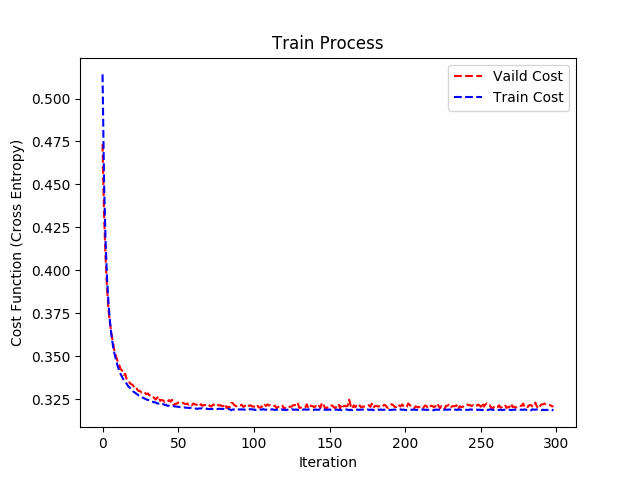

# Homework 4

## Purpose: Binary Classification

本次作业是需要从给定的个人资讯，预测此人的年收入是否大于50K。

## Data 简介

* 本次作业使用 [ADULT dataset](https://archive.ics.uci.edu/ml/datasets/Adult)

Barry Becker从1994年的人口普查数据库中进行了提取。 
（（AGE> 16）&&（AGI> 100）&&（AFNLWGT> 1）&&（HRSWK> 0））提取了一组合理清洁的记录。

* 共有32561笔训练资料，16281笔测试资料，其中资料维度为106。

## Summary 总结

本次作业执行 generative model 和 discriminative model。

- generative model 的困难点在于要假设资料的分配和变量之间的关系，如果资料越符合假设的分配效果也就越好
- discriminative model 的难点则是在于如何选择超参数

### Logistic Regression

一般对于二元分类最常用的方法为逻辑式回归(Logistic Regression)，其背后有一些统计的推导过程，在此就不多做说明，简单说逻辑式回归跟一般线性回归差别只在于计算线性回归之后再利用sigmoid函数将数值转换到0~1之间，另外将转换过的的数值透过门槛值来区分类别，而门槛值得设置可以根据资料的不同来做设计，常用门槛值为0.5。

在这作业我们将所有的训练资料中的20%当成验证集，由另外80%的资料集来训练参数。并使用 Mini-batch Gradient Descent 演算法来训练逻辑式回归的参数W和B，门槛值则用最一般的方式设置0.5。由下图可以清楚的看出随著叠代次数越来越多，不论是训练集或是验证集的 Cross entropy 都越来越小，且趋近于一致。这也就说明了模型参数学习得不错。最后在测试集的预测精准度为85%。

